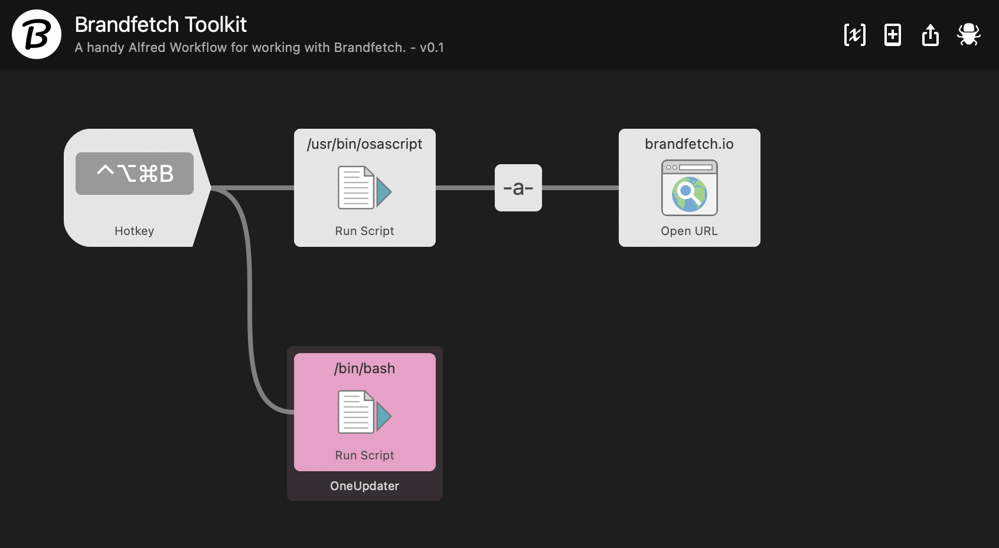

# Brandfetch Toolkit for Alfred

The Brandfetch Toolkit for Alfred makes it easy to look up the current browser window's URL using a keyboard shortcut.

# Installation

1. Download [brandfetch-toolkit.alfredworkflow](https://github.com/chrismessina/alfred-brandfetch-toolkit/raw/main/brandfetch-toolkit.alfredworkflow).
2. Double-click `brandfetch-toolkit.alfredworkflow` to install it.

_You will need to be an [Alfred Powerpack](https://www.alfredapp.com/powerpack/) user to enable this workflow._

# Usage

Set a custom keyboard shortcut to grab the URL from the frontmost browser window and send it to Brandfetch.

For example, when you visit a page on apple.com, you can use this worklflow to open the corresponding [Brandfetch page for Apple](https://brandfetch.io/apple.com):

# Changelog[¹](https://keepachangelog.com/)

## [v0.1.0] - 2020-12-08
- Initial Release

# About

This workflow is unaffiliated with nor endorsed by Brandfetch.

Thanks to [vitor](http://vitorgalvao.com) for his help in [writing the AppleScript](https://www.alfredforum.com/topic/15887-solved-workflow-to-append-current-browser-url-to-another-url/?do=findComment&comment=81012).

You can [file bugs](https://github.com/chrismessina/alfred-brandfetch-toolkit/issues/new) or [submit feature requests](https://github.com/chrismessina/alfred-brandfetch-toolkit/issues/new) on GitHub using the label `enhancement`.

Discuss on <a href="https://www.alfredforum.com/">Alfred Forum</a>.
